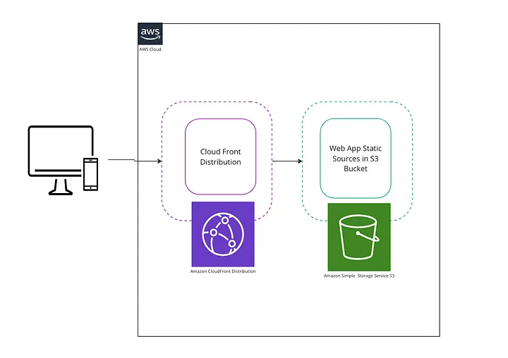

# To-Do App AWS CDK Infrastructure as Code

This AWS CDK project was created as some use cases for a simple To-Do website infrastructure as Code.

Here, you can reach my Medium article about [Hosting Static Website With S3 Bucket by AWS CDK](https://medium.com/idealo-tech-blog/hosting-static-website-with-s3-bucket-by-aws-cdk-a67c4a00b445)

If you like the solution, please don't forget to give a star ⭐ and follow me.

Thank you! ❤️

### To-Do App Infrastructure

### To-Do app UI

## Useful commands

The `cdk.json` file tells the CDK Toolkit how to execute your app.

* `npm run build`   compile typescript to js
* `npm run watch`   watch for changes and compile
* `npm run test`    perform the jest unit tests
* `cdk deploy`      deploy this stack to your default AWS account/region
* `cdk diff`        compare deployed stack with current state
* `cdk synth`       emits the synthesized CloudFormation template
